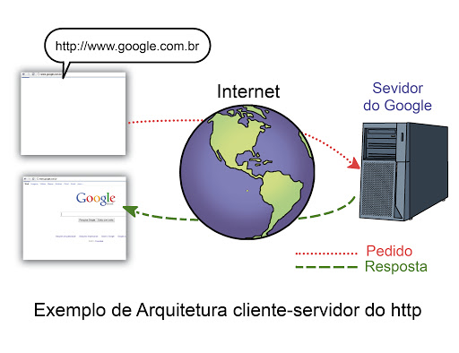

## HTTP

HTTP é um acrônimo para HyperTextTransferProtocol, ou Protocolo de Transferência de HiperTexto. Trata-se de um protocolo que estabelece como deve ocorrer a comunicação entre uma máquina cliente que faz pedidos para uma máquina servidora. Ele é normatizado por uma especificação, a [RFC 2616](http://tools.ietf.org/html/rfc2616).

O protocolo HTTP é baseado na comunicação entre uma máquina cliente que faz requisições para uma máquina servidora. Cada pedido que a máquina cliente faz para o servidor é chamado de requisição ou _request_; ao passo que a resposta do servidor para cada pedido é chamada de resposta ou _response_.

O protocolo HTTP é utilizado desde a década de 90 em páginas e aplicações Web.

Exemplo de arquitetura _cliente-servidor_ do HTTP:

Toda requisição HTTP é composta basicamente por duas partes distintas: cabeçalho (_header_) e corpo (_body_). O cabeçalho contém algumas informações específicas da requisição, como o tipo de resposta esperada do servidor e até mesmo o tempo de _timeout_. Já o corpo pode conter informações adicionais que o cliente pode enviar para o servidor que estarão atreladas à requisição (_request_). O corpo não é obrigatório, mas o cabeçalho é.

Da parte do request, há uma informação importantíssima que é enviada no cabeçalho: o método de requisição (_RequestMethod_). Este dado do cabeçalho indica que tipo de ação a URL que foi disparada para o servidor deverá realizar, dando sentido semântico - ou seja, significado - à requisição. O protocolo HTTP tem uma série de métodos, como _GET, POST, PUT, DELETE, HEAD, OPTIONS, TRACE e CONNECT_. Nós, na maioria do tempo, utilizamos mais os métodos **GET, POST, PUT e DELETE**. O significado destes métodos está na tabela abaixo:

| Método | Significado semântico                                                                                                                                                                                                                                                                                  |
| ------ | ------------------------------------------------------------------------------------------------------------------------------------------------------------------------------------------------------------------------------------------------------------------------------------------------------ |
| GET    | Significa que queremos “pegar” algo no servidor: uma página, por exemplo. Requisições GET fazem com que o servidor devolva algo para o cliente, algo que estava “dentro” do servidor.                                                                                                                  |
| POST   | Significa que estamos querendo incluir alguma coisa no servidor. Por exemplo, se temos uma página de cadastro de usuários, a requisição que vai fazer com que o servidor faça o insert no banco de dados deve ser uma requisição POST, afinal, estamos criando um novo item que vai ficar no servidor. |
| PUT    | Significa que estamos querendo atualizar alguma coisa no servidor.                                                                                                                                                                                                                                     |
| DELETE | Significa que estamos querendo apagar alguma coisa do servidor.                                                                                                                                                                                                                                        |

O servidor também retorna uma série de informações sobre ele. A resposta também contém indicadores sobre o controle de cache que o browser deverá executar (_cache-control_), o tipo de resposta retornado pelo servidor (_content-type_) e até mesmo a data em que a requisição foi processada no servidor. Agora, existe um item muito importante no cabeçalho de resposta: trata-se do status da resposta. É através deste status que o cliente sabe se a requisição retornou sucesso ou se algo deu errado.

Os status HTTP também são padronizados pela especificação. Os principais status HTTP que temos são:

| Status | Descrição                                                                                                                                                                                   |
| ------ | ------------------------------------------------------------------------------------------------------------------------------------------------------------------------------------------- |
| 200    | _OK_. Significa que o servidor entendeu a requisição e a processou sem problemas.                                                                                                           |
| 302    | _Found_. Significa que o recurso solicitado de fato existe no servidor (status típico de requisições GET)                                                                                   |
| 401    | _Unauthorized_. Significa que você tentou acessar algum recurso do servidor que exige autenticação para acesso, e você ainda não realizou este processo.                                    |
| 404    | _NotFound_. Significa que você solicitou algum recurso no servidor que não existe no lugar que você indicou. Por exemplo: se você tenta acessar alguma página de algum site que não existe. |
| 500    | _Internal Server Error_. Significa que o servidor encontrou um erro durante o processamento da requisição.                                                                                  |

É através destes status HTTP que o cliente sabe se a requisição que ele disparou deu certo ou não.

O protocolo HTTP ainda possui algumas características que precisamos conhecer:

- O protocolo HTTP é **stateless**. Isso significa que ele não guarda estado;

- O protocolo HTTP é **independente**. Quando você faz uma requisição para o servidor, ela é tratada de maneira isolada das demais requisições, sendo impossível fazer com que requisições se comuniquem umas com as outras;

- O protocolo HTTP é **assíncrono**, ou seja: você pode fazer várias requisições ao mesmo tempo.
